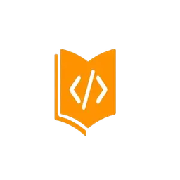
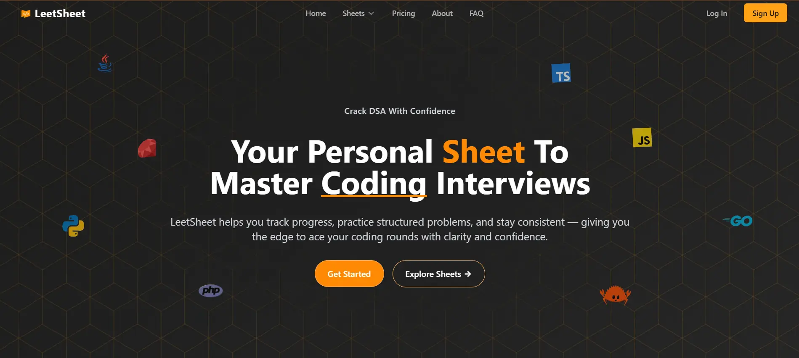
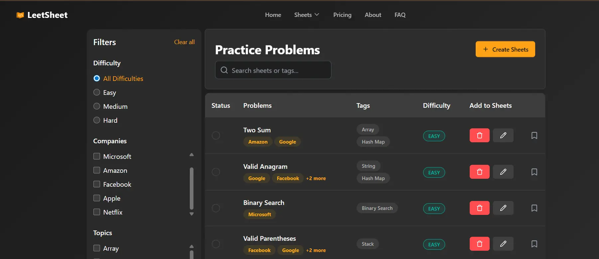

         
 
 

#                      
   LeetSheet 

## Your Personal Sheet To Master Coding Interviews

LeetSheet is a comprehensive platform designed to help you practice coding problems, track progress, and prepare for technical interviews with structured problem sheets. It gives you the edge to ace your coding rounds with clarity and confidence.

## What is LeetSheet?

  

LeetSheet is a specialized platform for coding interview preparation that helps you:

- Track your progress systematically
- Practice structured problems organized by company, difficulty, and topic
- Stay consistent with your preparation
- Master Data Structures and Algorithms with confidence

## Key Features

### Algorithm Practice

  

Master essential data structures and algorithms with company-focused problem sets designed to boost your coding skills. Problems are categorized by:

- Company (Google, Microsoft, Amazon, Facebook, Apple, Netflix, and more)
- Difficulty levels (Easy, Medium, Hard)
- Topics (Arrays, Dynamic Programming, Graphs, Trees, etc.)

### Advanced Code Editor

  

Our integrated code editor provides a seamless coding experience with:

- Syntax highlighting
- Multiple language support (JavaScript, Python, Java, Ruby, Rust, TypeScript, PHP, Go)
- Real-time execution and testing
- Detailed submission analysis

### Progress Analytics

Track your performance with detailed insights, identify weak areas, and measure your growth over time. Our analytics help you:

- Visualize your solving patterns
- Identify areas that need improvement
- Track consistency and progress

### Achievement System

Stay motivated by earning badges and climbing the leaderboard as you solve problems and improve your skills. Gamification elements keep your learning journey engaging.

### Custom Sheets

Create personalized DSA sheets tailored to your goals and progress. Focus on the topics that matter most to you and organize your preparation effectively.

## Why Choose LeetSheet?

- **Structured Approach**: Problems organized in a way that builds your skills progressively
- **Company-Specific Questions**: Practice with questions frequently asked by top tech companies
- **Performance Tracking**: Monitor your progress and identify improvement areas
- **Comprehensive Platform**: Everything you need for interview preparation in one place
- **Community Support**: Learn and grow with fellow developers

## Coming Soon

- Premium curated questions for advanced preparation
- Ability to contribute custom problems to the platform
- Hints, explanations, and step-by-step solutions to guide you through challenges
- More company-specific question sets

## DSA Made Clear, Concise, and Career-Ready

LeetSheet transforms your coding interview preparation from overwhelming to organized, giving you the confidence to tackle any technical interview with ease.

Start mastering DSA with LeetSheet today and take your coding interview skills to the next level!

## Connect With Me

  
  
  

        